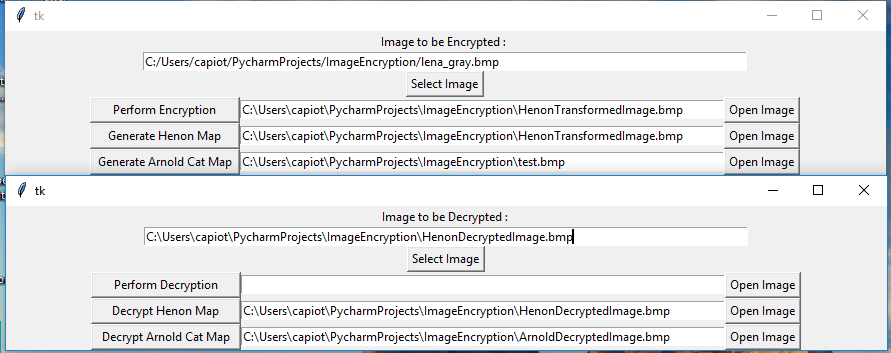
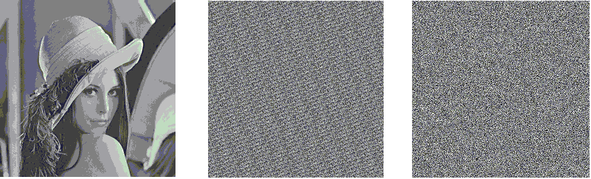

# Image-Encryption-Using-Chaotic-Map
* Image Encryption using Arnold Cat Map and Henon Map. 
* Process is Arnold Cat Map followed by Henon Map and reverse for decryption.
* Henon key values used are x=0.1,y=0.1

## Steps to Encrypt
* Run ImageEncryption UI.py for encrypting an image
* Place the image path under the select image label.
* Enter the Number of iterations for the arnold cat map shuffling along with value of n in Mod n.
* One can select either of the two buttons "Generate Arnold Cat Map" or "Generate Henon Map"
* Or click on perform encryption.
* Full image file path appears in the text box next to the buttons.

## Steps to Decrypt
* Run Image Decryption UI.py for decrypting an image.
* Follow steps similar to encryption but in reverse order.

